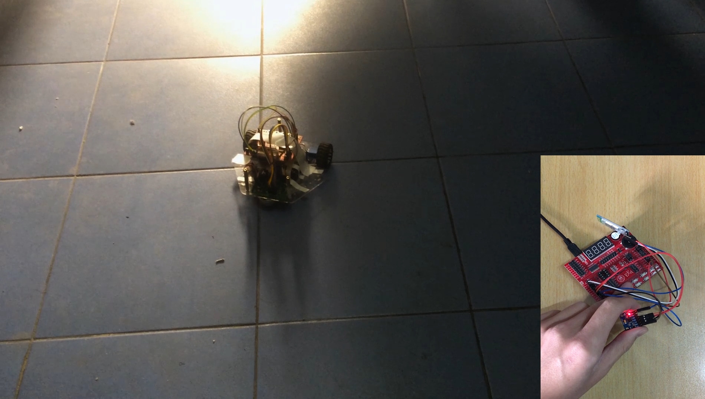
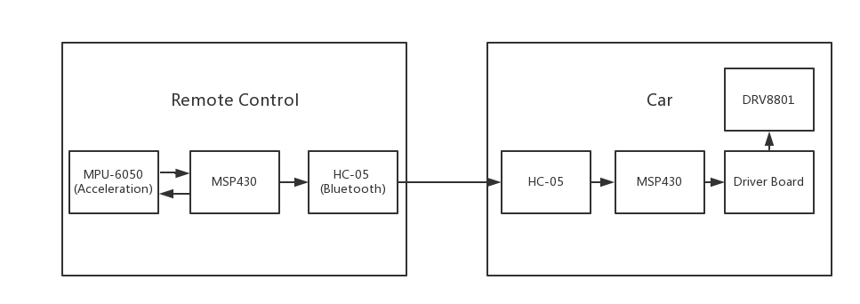
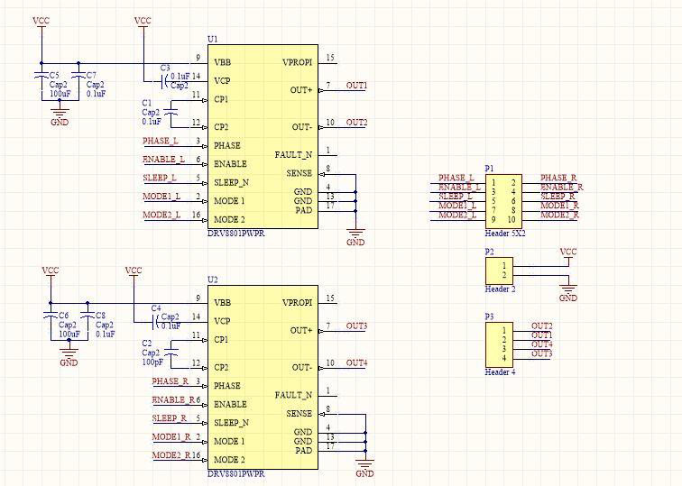
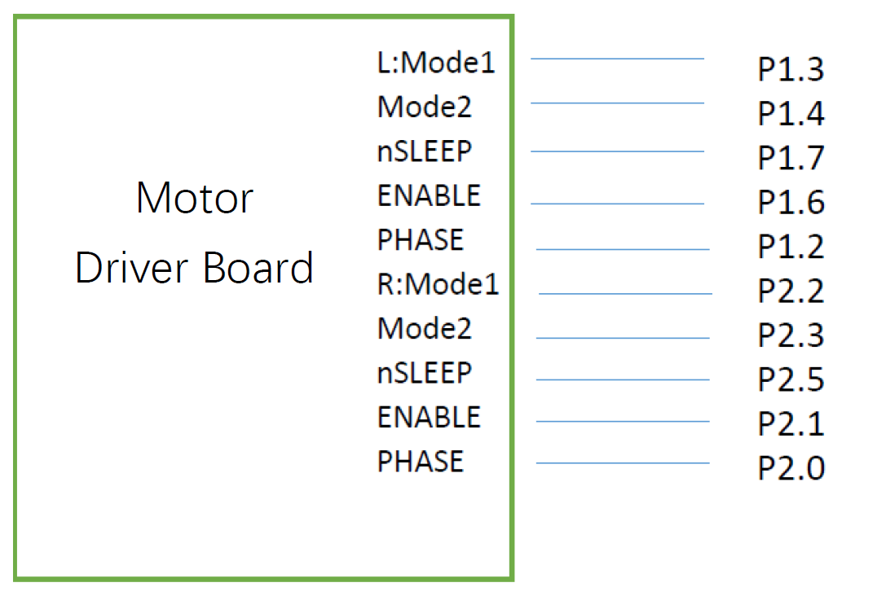
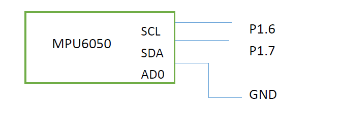

**Motion sensing RC car**  
A motion sensing RC car based on acceleration sensor and MSP430 micro-controller  
  
**Car**  
 

**Remote Control Unit**  
  

**Hardware Requirement**  
1. Car with 2 wheel and 1 universal wheel  
2. MSP430G2553 development board * 2  
3. HC-05 Bluetooth module *2 (one master one slave)  
4. Motor * 2  
5. MPU-6050 * 1  
6. Motor driver board * 1  

**System Design**  
  

**Driver Board Design**  
  

**Pin Configuration**  
Driver Board Controller  
  

Control Unit Controller  
  

