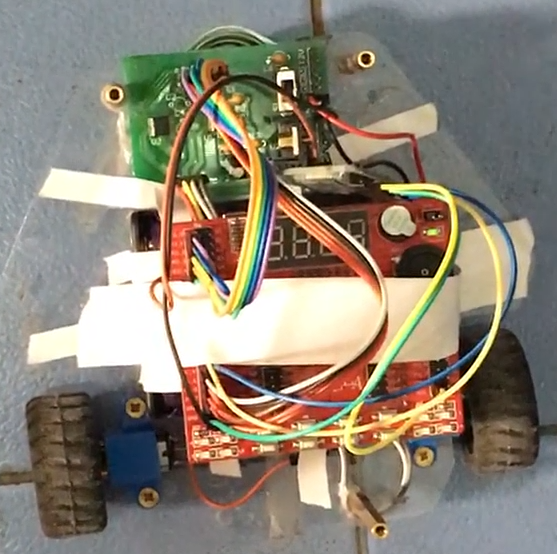
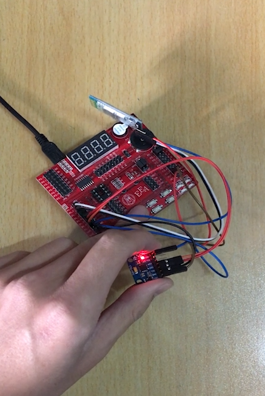

**Motion sensing RC car**  
A motion sensing RC car based on acceleration sensor and MSP430 micro-controller  

**Features**  
**1. Motion sensing RC car**: Turn the acceleration sensor to control the direction of the car  
**2. Music playing**: Play simple music with two independent motor  

**Usage Instructions**  
Set P1.3 low to stop anything   
Set P1.4 high to control the car moving  
Set P1.5 high & P1.4 low to play music with its wheels  

**Physical Display**  
**Car**  
 

**Remote Control Unit**  
  

**Hardware Requirement**  
1. Car with 2 wheel and 1 universal wheel  
2. MSP430G2553 development board * 2  
3. HC-05 Bluetooth module *2 (one master one slave)  
4. Motor * 2  
5. MPU-6050 * 1  
6. Motor driver board * 1  
7. Power supply  

**System Design**  
  

**Driver Board Design**  
  

**Pin Configuration**  
Driver Board Controller  
  

Control Unit Controller  
  

